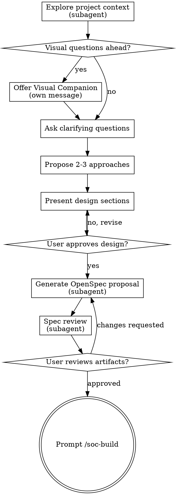

# Brainstorming Ideas Into OpenSpec Proposals

Help turn ideas into fully formed designs through natural collaborative dialogue, then generate all OpenSpec artifacts via CLI.

Start by understanding the current project context, then ask questions one at a time to refine the idea. Once you understand what you're building, present the design and get user approval. After approval, generate the OpenSpec proposal.

<HARD-GATE>
Do NOT invoke any implementation skill, write any code, scaffold any project, or take any implementation action until you have presented a design and the user has approved it AND all OpenSpec artifacts are generated. This applies to EVERY project regardless of perceived simplicity.
</HARD-GATE>

## Anti-Pattern: "This Is Too Simple To Need A Design"

Every project goes through this process. A todo list, a single-function utility, a config change — all of them. "Simple" projects are where unexamined assumptions cause the most wasted work. The design can be short (a few sentences for truly simple projects), but you MUST present it and get approval.

## Context Window Strategy

Complex features demand more discussion space. To maximize the conversation depth, delegate all **execution** work to subagents and keep only **dialogue and design** in the main agent's context:

- **Subagent**: Project exploration, OpenSpec artifact generation, spec review
- **Main agent**: Clarifying questions, approach selection, design writing, user interaction


## Checklist

You MUST create a task for each of these items and complete them in order:

1. **Explore project context** (subagent) — delegate to Explore subagent, get structured summary
2. **Offer visual companion** (if topic will involve visual questions) — this is its own message, not combined with a clarifying question. See the Visual Companion section below.
3. **Ask clarifying questions** — one at a time, understand purpose/constraints/success criteria
4. **Propose 2-3 approaches** — with trade-offs and your recommendation
5. **Present design** — in sections scaled to their complexity, get user approval after each section
6. **Generate OpenSpec proposal** (subagent) — delegate to subagent with confirmed design content
7. **Spec review** (subagent) — delegate review of generated artifacts
8. **User reviews generated artifacts** — ask user to review before proceeding
9. **Transition to implementation** — prompt user to run `/soc-build`

## Process Flow



**The terminal state is prompting the user to run `/soc-build`.** Do NOT invoke bss:build, frontend-design, or any other implementation skill directly. The user decides when to start building.

## The Process

### Step 1: Explore Project Context (Subagent)

Delegate project exploration to a subagent to avoid loading raw file content into the main context.

**Dispatch:**
```
Agent tool (subagent_type: "Explore"):
  description: "Explore project context"
  prompt: |
    Explore the current project to understand its context for a new feature.
    Return a structured summary covering:

    1. **Tech stack**: languages, frameworks, key dependencies
    2. **Directory structure**: top-level layout and relevant subdirectories
    3. **Related files**: files most likely relevant to "<user's request>"
    4. **Recent changes**: last 5-10 commits summary
    5. **Existing patterns**: code conventions, testing patterns, config patterns
    6. **Constraints**: any obvious constraints from the codebase (e.g., "no database, file-based storage")

    User's request: "<user's request>"
    Project root: <project-root>

    Be thorough but concise. The summary will be used for brainstorming — include
    anything that would inform design decisions. Omit anything not relevant to the request.

    Report in under 500 words.
```

Use the summary to inform your questions. If you need deeper detail on a specific area later, dispatch a focused follow-up exploration.

### Step 2: Visual Companion (Conditional)

If the topic will involve visual questions (UI, layout, diagrams), offer the visual companion. See the Visual Companion section below.

### Step 3-5: Dialogue and Design (Main Agent)

**Understanding the idea:**

- Use the exploration summary to understand the project landscape
- Before asking detailed questions, assess scope: if the request describes multiple independent subsystems (e.g., "build a platform with chat, file storage, billing, and analytics"), flag this immediately. Don't spend questions refining details of a project that needs to be decomposed first.
- If the project is too large for a single spec, help the user decompose into sub-projects: what are the independent pieces, how do they relate, what order should they be built? Then brainstorm the first sub-project through the normal design flow. Each sub-project gets its own spec → build → archive cycle.
- For appropriately-scoped projects, ask questions one at a time to refine the idea
- Prefer multiple choice questions when possible, but open-ended is fine too
- Only one question per message - if a topic needs more exploration, break it into multiple questions
- Focus on understanding: purpose, constraints, success criteria

**Exploring approaches:**

- Propose 2-3 different approaches with trade-offs
- Present options conversationally with your recommendation and reasoning
- Lead with your recommended option and explain why

**Defining acceptance criteria:**

- Every design MUST include a clear, verifiable **Acceptance Criteria** section
- Acceptance criteria define the **final verification checklist** that the completed implementation must pass — they are the definition of "done"
- Criteria must be:
  - **Specific**: no ambiguous terms like "works well" or "good performance" — use exact thresholds where possible
  - **Testable**: each criterion can be verified by a concrete action (run a test, inspect output, check a metric)
  - **Complete**: covering functional correctness, edge cases, error handling, and integration points
- Present acceptance criteria as a numbered checklist, each item starting with a measurable assertion (e.g., "API returns 200 with valid payload for all valid inputs", "Error response contains actionable message for invalid input")
- If the user cannot define acceptance criteria for a feature, the feature's requirements are not yet clear enough — ask more questions

**Presenting the design:**

- Once you believe you understand what you're building, present the design
- Scale each section to its complexity: a few sentences if straightforward, up to 200-300 words if nuanced
- Ask after each section whether it looks right so far
- Cover: architecture, components, data flow, error handling, testing, **acceptance criteria**
- Be ready to go back and clarify if something doesn't make sense

**Design for isolation and clarity:**

- Break the system into smaller units that each have one clear purpose, communicate through well-defined interfaces, and can be understood and tested independently
- For each unit, you should be able to answer: what does it do, how do you use it, and what does it depend on?
- Can someone understand what a unit does without reading its internals? Can you change the internals without breaking consumers? If not, the boundaries need work.
- Smaller, well-bounded units are also easier for you to work with - you reason better about code you can hold in context at once, and your edits are more reliable when files are focused. When a file grows large, that's often a signal that it's doing too much.

**Working in existing codebases:**

- Use the exploration summary to understand existing patterns before proposing changes
- Where existing code has problems that affect the work (e.g., a file that's grown too large, unclear boundaries, tangled responsibilities), include targeted improvements as part of the design - the way a good developer improves code they're working in.
- Don't propose unrelated refactoring. Stay focused on what serves the current goal.

### Step 6: Generate OpenSpec Proposal (Subagent)

After the user confirms the design, delegate the entire OpenSpec CLI workflow to a subagent.

**Input**: Derive a kebab-case name from the discussion (e.g., "add user authentication" → `add-user-auth`).

**Dispatch:**
```
Agent tool (subagent_type: "general-purpose"):
  description: "Generate OpenSpec proposal: <name>"
  prompt: |
    You are generating an OpenSpec change proposal. Follow the exact CLI workflow below.

    ## Change Name

    <name>

    ## Design Content

    The user has confirmed the following design. Use this as the content basis for all artifacts:

    <paste the full confirmed design from the brainstorming conversation>

    ## Project Context

    <paste the exploration summary from Step 1>

    ## Steps

    1. **Create the change directory**
       ```bash
       openspec new change "<name>"
       ```

    2. **Get the artifact build order**
       ```bash
       openspec status --change "<name>" --json
       ```
       Parse the JSON to get:
       - `applyRequires`: array of artifact IDs needed before implementation
       - `artifacts`: list of all artifacts with their status and dependencies
       - `planningHome`, `changeRoot`, `artifactPaths`, and `actionContext`: path and scope context

    3. **Create artifacts in sequence until apply-ready**

       Use the TodoWrite tool to track progress through the artifacts.

       Loop through artifacts in dependency order (artifacts with no pending dependencies first):

       a. **For each artifact that is `ready` (dependencies satisfied)**:
          - Get instructions:
            ```bash
            openspec instructions <artifact-id> --change "<name>" --json
            ```
          - The instructions JSON includes:
            - `context`: Project background (constraints for you - do NOT include in output)
            - `rules`: Artifact-specific rules (constraints for you - do NOT include in output)
            - `template`: The structure to use for your output file
            - `instruction`: Schema-specific guidance for this artifact type
            - `resolvedOutputPath`: Resolved path or pattern to write the artifact
            - `dependencies`: Completed artifacts to read for context
          - Read any completed dependency files for context
          - Create the artifact file using `template` as the structure and write it to `resolvedOutputPath`
          - Use the design content above as the content basis
          - Apply `context` and `rules` as constraints - but do NOT copy them into the file
          - Show brief progress: "Created <artifact-id>"

       b. **Continue until all `applyRequires` artifacts are complete**
          - After creating each artifact, re-run `openspec status --change "<name>" --json`
          - Check if every artifact ID in `applyRequires` has `status: "done"` in the artifacts array
          - Stop when all `applyRequires` artifacts are done

    4. **Show final status**
       ```bash
       openspec status --change "<name>"
       ```

    ## Artifact Creation Guidelines

    - Follow the `instruction` field from `openspec instructions` for each artifact type
    - The schema defines what each artifact should contain - follow it
    - Read dependency artifacts for context before creating new ones
    - Use `template` as the structure for your output file - fill in its sections
    - **IMPORTANT**: `context` and `rules` are constraints for YOU, not content for the file
      - Do NOT copy `<context>`, `<rules>`, `<project_context>` blocks into the artifact
      - These guide what you write, but should never appear in the output
    - **Acceptance Criteria**: Ensure the acceptance criteria from the confirmed design are reflected in the appropriate artifacts (design.md, tasks.md). Each task in tasks.md MUST have clear, testable acceptance criteria that implementation must satisfy before being considered complete

    ## Report Format

    When done, report:
    - Change name and location
    - List of artifacts created with brief descriptions
    - Final status output from `openspec status`

    If any step fails, report the error and what you attempted.
```

The subagent handles all CLI execution, instruction parsing, and artifact creation. The main agent only receives the final report.

### Step 7: Spec Review (Subagent)

After artifacts are generated, delegate review to a subagent using the spec-reviewer-prompt template.

**Dispatch:**
```
Agent tool (subagent_type: "general-purpose"):
  description: "Review OpenSpec artifacts for <name>"
  prompt: |
    You are reviewing whether a set of OpenSpec artifacts are complete and consistent.

    **Change:** <name>
    **Artifacts location:** openspec/changes/<name>/

    Read all generated artifacts (proposal.md, specs/, design.md, tasks.md).

    ## What to Check

    | Category | What to Look For |
    |----------|------------------|
    | Completeness | TODOs, placeholders, "TBD", incomplete sections |
    | Consistency | Internal contradictions between artifacts, conflicting requirements |
    | Clarity | Requirements ambiguous enough to cause someone to build the wrong thing |
    | Scope | Focused enough for a single implementation — not covering multiple independent subsystems |
    | YAGNI | Unrequested features, over-engineering |
    | Task coverage | Do tasks.md tasks cover everything in design.md? |
    | Acceptance criteria | Does each task have specific, testable acceptance criteria? Are criteria measurable and unambiguous? Can each be verified by a concrete action? |

    ## Calibration

    **Only flag issues that would cause real problems during implementation.**
    A missing section, a contradiction, or a requirement so ambiguous it could be
    interpreted two different ways — those are issues. Minor wording improvements,
    stylistic preferences, and "sections less detailed than others" are not.

    Approve unless there are serious gaps that would lead to a flawed implementation.

    ## Output Format

    **Status:** Approved | Issues Found

    **Issues (if any):**
    - [Artifact, Section]: [specific issue] - [why it matters for implementation]

    **Recommendations (advisory, do not block approval):**
    - [suggestions for improvement]
```

If the reviewer finds issues, fix them directly (they are just file edits) and move on. Do NOT re-dispatch the reviewer.

### Step 8: User Review Gate

Ask the user to review the generated artifacts before proceeding:

> "OpenSpec proposal generated at `openspec/changes/<name>/`. Please review the artifacts and let me know if you want to make any changes before we start implementation."

Wait for the user's response. If they request changes, make them directly. Only proceed once the user approves.

### Step 9: Transition to Implementation

After user approval, output:

- Change name and location
- List of artifacts created with brief descriptions
- "All artifacts created! Ready for implementation."
- "Run `/soc-build` to start implementation."

Do NOT invoke `/soc-build` directly. The user decides when to start building.

## Key Principles

- **One question at a time** - Don't overwhelm with multiple questions
- **Multiple choice preferred** - Easier to answer than open-ended when possible
- **YAGNI ruthlessly** - Remove unnecessary features from all designs
- **Explore alternatives** - Always propose 2-3 approaches before settling
- **Incremental validation** - Present design, get approval before moving on
- **Be flexible** - Go back and clarify when something doesn't make sense

## Visual Companion

A browser-based companion for showing mockups, diagrams, and visual options during brainstorming. Available as a tool — not a mode. Accepting the companion means it's available for questions that benefit from visual treatment; it does NOT mean every question goes through the browser.

**Offering the companion:** When you anticipate that upcoming questions will involve visual content (mockups, layouts, diagrams), offer it once for consent:
> "Some of what we're working on might be easier to explain if I can show it to you in a web browser. I can put together mockups, diagrams, comparisons, and other visuals as we go. This feature is still new and can be token-intensive. Want to try it? (Requires opening a local URL)"

**This offer MUST be its own message.** Do not combine it with clarifying questions, context summaries, or any other content. The message should contain ONLY the offer above and nothing else. Wait for the user's response before continuing. If they decline, proceed with text-only brainstorming.

**Per-question decision:** Even after the user accepts, decide FOR EACH QUESTION whether to use the browser or the terminal. The test: **would the user understand this better by seeing it than reading it?**

- **Use the browser** for content that IS visual — mockups, wireframes, layout comparisons, architecture diagrams, side-by-side visual designs
- **Use the terminal** for content that is text — requirements questions, conceptual choices, tradeoff lists, A/B/C/D text options, scope decisions

A question about a UI topic is not automatically a visual question. "What does personality mean in this context?" is a conceptual question — use the terminal. "Which wizard layout works better?" is a visual question — use the browser.

If they agree to the companion, read the detailed guide before proceeding:
`skills/soc-/spec/visual-companion.md`
