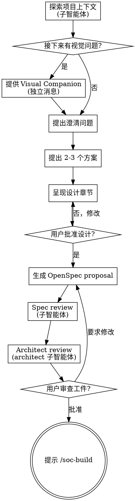

# 把 idea 头脑风暴成 OpenSpec proposal

通过自然的协作对话帮助把 idea 变成完整设计，然后通过 CLI 生成所有 OpenSpec 工件。

先理解当前项目上下文，然后一次一个问题地细化 idea。理解清楚要构建什么之后，呈现设计并获得用户批准。批准后生成 OpenSpec
proposal。

<HARD-GATE>
在你呈现设计并获得用户批准**且**所有 OpenSpec 工件都已生成之前，**不要**调用任何实现 skill、写任何代码、scaffold 任何项目，或采取任何实现动作。这适用于**每个**项目，无论看起来多简单。
</HARD-GATE>

## 反模式："这太简单了不需要设计"

每个项目都走这个流程。一个 todo list、一个单函数工具、一个 config 改动——全都包括。"简单"
的项目恰恰是未经审视的假设造成最多返工的地方。设计可以很短（对真正简单的项目就几句话），但你**必须**呈现设计并获得批准。

## 上下文窗口策略

复杂特性需要更多讨论空间。为了最大化对话深度，把所有**执行**工作委托给子智能体，只把**对话与设计**保留在主智能体的上下文中：

- **子智能体**：项目探索、spec review、architect review
- **主智能体**：澄清问题、方案选择、设计撰写、用户交互

## Checklist

你**必须**为以下每一项创建任务并按顺序完成：

1. **探索项目上下文**（子智能体）—— 委托给 Explore 子智能体，获取结构化摘要
2. **提供 Visual Companion**（如果话题将涉及视觉问题）—— 这是独立的一条消息，不与澄清问题合并。详见下文 Visual Companion 段。
3. **提出澄清问题**—— 一次一个，理解目的/约束/成功标准
4. **提出 2-3 个方案**—— 含 trade-off 和你的推荐
5. **呈现设计**—— 按章节切分，复杂度匹配，尽可能使用图形化方式呈现关键设计与流程。每节后获得用户批准
6. **生成 OpenSpec proposal**
7. **两阶段 review**：
    - **7a. Spec review**（子智能体）—— `spec-reviewer-prompt.md`：完整性、一致性、范围、YAGNI、任务覆盖度
    - **7b. Architect review**（architect 子智能体）—— `architect-reviewer-prompt.md`：架构合理性、模式对齐、代码味道风险
8. **用户审查生成的工件**—— 请用户在继续前审查
9. **过渡到实现**—— 提示用户运行 `/soc-build <change-name>`

## 流程图



**终态是提示用户运行 `/soc-build`。**不要直接调用 /soc-build或任何其他实现 skill。由用户决定何时开始构建。

## 流程详解

### Step 1: 探索项目上下文（子智能体）

把项目探索委托给子智能体，避免把原始文件内容加载进主上下文。

**派发指令：**

```
Agent tool (subagent_type: "Explore"):
  description: "探索项目上下文"
  prompt: |
    探索当前项目，理解其为新特性的上下文。
    返回结构化摘要，覆盖：

    1. **Tech stack**：语言、框架、关键依赖
    2. **目录结构**：顶层布局和相关子目录
    3. **相关文件**：最可能与 "<user's request>" 相关的文件
    4. **最近变更**：最近 5-10 个 commit 摘要
    5. **已有模式**：代码约定、测试模式、配置模式
    6. **约束**：从代码库能看出的明显约束（如"无数据库，基于文件的存储"）

    用户请求："<user's request>"
    项目根：<project-root>

    要彻底但简练。摘要将用于头脑风暴——包含任何会影响设计决策的内容。omit 任何与请求无关的内容。

    500 字内汇报。
```

用这个摘要来指导你的提问。如果后续需要对某个领域深入细节，再派发一次聚焦的 follow-up 探索。

### Step 2: Visual Companion（条件性）

如果话题将涉及视觉问题（UI、布局、图），提供 Visual Companion。详见下文 Visual Companion 段。

### Step 3-5: 对话与设计（主智能体）

**理解 idea：**

- 用探索摘要理解项目全貌
- 在问详细问题前，先评估范围：如果请求描述了多个独立子系统（如"构建一个平台，含 chat、文件存储、计费、分析"
  ），立即指出。不要花问题去细化一个需要先分解的项目的细节。
- 如果项目对单个 spec 来说太大，帮用户分解成子项目：独立的子部分是什么？它们如何关联？应该按什么顺序构建？然后通过正常的设计流程头脑风暴第一个子项目。每个子项目有自己独立的
  spec → build → archive 循环。
- 对范围合适的项目，**一次问一个**问题来细化 idea
- 尽可能优先用多选题，但开放性问题也可以
- 每条消息只问一个问题——如果一个话题需要更多探索，拆成多个问题
- 聚焦于理解：目的、约束、成功标准

**探索方案：**

- 提出 2-3 个不同方案，含 trade-off
- 用对话方式呈现选项，附你的推荐和理由
- 以你推荐的方案开头，解释为什么

**定义 acceptance criteria：**

- 每个设计都**必须**包含清晰、可验证的 **Acceptance Criteria** 段
- Acceptance criteria 定义完成实现后必须通过的**最终验证 checklist**——它们是"完成"的定义
- Criteria 必须是：
    - **Specific**：不要用"works well"或"good performance"这类模糊词——尽可能用精确阈值
    - **Testable**：每条 criterion 都能通过具体动作验证（跑测试、检查输出、看指标）
    - **Complete**：覆盖功能正确性、边界情况、错误处理、集成点
- Acceptance criteria 以编号 checklist 形式呈现，每项以可测量的断言开头（如"API 对所有合法输入返回 200"、"
  错误响应含对非法输入的可操作提示"）
- 如果用户无法为某个特性定义 acceptance criteria，这个特性的需求还不够清晰——继续问问题

**呈现设计：**

- 一旦你相信自己理解了要构建什么，呈现设计
- 按章节复杂度匹配内容长度：直白的内容几句话即可，复杂的内容最多 200-300 字，尽可能使用图形化方式呈现架构设计、业务流程、数据流向等
- 每节后问一下"目前看起来对吗"
- 覆盖：架构、组件、数据流、错误处理、测试、**acceptance criteria**
- 准备好回头澄清不合理的地方

**为隔离和清晰而设计：**

- 把系统拆成更小的单元，每个单元有单一明确目的，通过良好定义的接口通信，能独立理解和测试
- 对每个单元，你应该能回答：它做什么、怎么用、依赖什么？
- 别人能不理解它的内部就读懂一个单元吗？你能改内部而不破坏消费者吗？如果不能，边界需要打磨。
- 更小、边界清晰的单元也更容易让你工作——你能更好地推理可以一次放进上下文的代码，文件聚焦时你的编辑也更可靠。一个文件变大时，往往就是它在做太多事情的信号。

**任务切片：为 `/soc-build` 子智能体自足而设计：**

`/soc-build` 把每个任务派发为**独立子智能体**——它只读 `proposal.md`（全文）、`tasks.md`（定位自己）、`design.md`（仅相关切片），不继承会话历史。任务的切法直接决定子智能体能否一次过：

- **每个任务必须是自足的一组紧密关联的工作单元**：一个子智能体在不读全量 design 的前提下能规划完。如果一个任务跨多个不相关模块，拆开。
- **design.md 按 `## Task N.M` 分章节**：每个任务章节包含「目标 / 涉及文件 / 接口契约 / 关键决策」。`/soc-build` 子智能体按 task ID grep 切片——没有章节化它就只能 dump 整个文件，上下文膨胀且容易漏读。
- **tasks.md 每个 task 行下内联 AC**：每条 AC 以可测断言开头（"API 返回 200"而不是"API 正常工作"）。`/soc-build` 子智能体会逐字引用 AC-1、AC-2 写入实现计划——AC 写在 design.md 而不内联在 tasks.md，子智能体就漏读。

任务切片的合理性比设计的精巧更决定 `/soc-build` 的成败。在设计阶段就要带着"这件事能不能拆成 N 个独立子智能体一次过"的视角去切。

**在现有代码库中工作：**

- 用探索摘要在提出改动前理解现有模式
- 当现有代码有问题且影响当前工作（如文件变得太大、边界不清、责任纠缠），把针对性改进作为设计的一部分——就像一个好的开发者在改善他正在工作的代码一样。
- 不要提出无关的重构。聚焦于服务当前目标的内容。

### Step 6: 生成 OpenSpec proposal

用户确认设计后，从讨论中推导一个 kebab-case 名字（如"add user authentication" → `add-user-auth`）。开始生产openspec change。

#### 步骤

    1. **创建 change 目录**
       ```bash
       openspec new change "<name>"
       ```

    2. **获取工件构建顺序**
       ```bash
       openspec status --change "<name>" --json
       ```
       解析 JSON 获取：
       - `applyRequires`：实现前需要的工件 ID 数组
       - `artifacts`：所有工件列表，含状态和依赖
       - `planningHome`、`changeRoot`、`artifactPaths` 和 `actionContext`：路径和作用域上下文

    3. **按顺序创建工件直到 apply-ready**

       用 TodoWrite 工具跟踪工件进度。

       按依赖顺序循环（先处理无 pending 依赖的工件）：

       a. **对每个 `ready`（依赖满足）的工件**：
          - 获取指令：
            ```bash
            openspec instructions <artifact-id> --change "<name>" --json
            ```
          - 指令 JSON 包含：
            - `context`：项目背景（对你的约束——**不要**放进输出）
            - `rules`：工件特定的规则（对你的约束——**不要**放进输出）
            - `template`：输出文件使用的结构
            - `instruction`：对此工件类型的 schema-specific 指导
            - `resolvedOutputPath`：解析过的输出路径或模式
            - `dependencies`：为上下文而读的已完成工件
          - 读任何已完成的依赖文件作为上下文
          - 用 `template` 作为结构创建工件文件，写入 `resolvedOutputPath`
          - 以上面的设计内容作为内容基础
          - 把 `context` 和 `rules` 作为约束应用——但**不要**把它们复制进文件
          - 简短显示进度："Created <artifact-id>"

       b. **继续直到所有 `applyRequires` 工件完成**
          - 创建每个工件后，重跑 `openspec status --change "<name>" --json`
          - 检查 `applyRequires` 中的每个工件 ID 是否在 artifacts 数组中状态为 `status: "done"`
          - 全部 done 后停止

    4. **显示最终状态**
       ```bash
       openspec status --change "<name>"
       ```

#### 工件创建指南

    - 对每个工件类型，遵循 `openspec instructions` 的 `instruction` 字段
    - schema 定义了每个工件应包含什么——遵循它
    - 创建新工件前读依赖工件作为上下文
    - 用 `template` 作为输出文件结构——填充它的章节
    - **重要**：`context` 和 `rules` 是对你的约束，**不是**文件的内容
      - **不要**把 `<context>`、`<rules>`、`<project_context>` 块复制进工件
      - 它们指导你写什么，但**永远不应**出现在输出中
    - **Acceptance Criteria**：确保确认设计中的 acceptance criteria 反映在合适的工件中（design.md、tasks.md）。tasks.md 中**每个任务**都必须有清晰、可测试的 acceptance criteria，实现必须在被认为完成前满足

    #### design.md / tasks.md 结构约定（强制，对齐 `/soc-build` 子智能体协议）

    **为什么强制：** `/soc-build` 把每个任务派发为隔离上下文的子智能体。子智能体按 task ID 去 design.md 里 grep `## Task N.M` 章节读切片、按 tasks.md 里 task 行下的 AC 写实现 checklist。结构不齐 → 子智能体 dump 全文 / 漏读 AC / 规划混乱。

    **design.md 结构：**

    - 按 `## Task N.M` 分章节，章节 ID 与 tasks.md 任务 ID **一一对应**（顺序也一致）
    - 每个章节含 4 个子段：
      - **目标**：1-2 句话说明这个任务达成什么
      - **涉及文件**：要新建/修改的文件清单（路径 + 改动性质）
      - **接口契约**：对外暴露的 API/类型/事件/DB schema 变化（无则显式写"无"）
      - **关键决策**：实现者必须知道的 trade-off、约束、与其他任务的耦合点
    - 横切关注（如统一错误模型、共享类型定义）单独成章，并在每个相关 task 章节里交叉引用
    - 章节内的代码示例只放契约骨架（接口签名、类型定义），不放完整实现

    **tasks.md 结构：**

    - 每个 task 行格式：`- [ ] N.M <title> [gates: ...] [scope: ...]`
      - `[gates: ...]` 可选，标明该任务的门禁（`test`、`lint`、`typecheck` 等）；省略则 `/soc-build` 默认跑所有检测到的门禁
      - `[scope: ...]` 可选，逗号分隔的模块/目录路径，帮子智能体机械化判断"scope 内测试"范围
    - task 行下方**缩进**列出该任务的 AC，每条以 `AC-K` 编号开头：
      ```
      - [ ] 1.2 创建主题切换组件 [gates: test,lint] [scope: src/theme]
        - AC-1: ThemeSwitcher 渲染时显示 currentTheme 名称
        - AC-2: 点击切换后 document.documentElement.dataset.theme 在一帧（≤16ms）内更新
        - AC-3: 非法 theme 值回退到默认主题并触发 onError 回调
      ```
    - AC 必须以可测断言开头（"返回 200"、"在 16ms 内更新"、"触发 onError"），禁止模糊词（"性能好"、"体验流畅"、"正常工作"）
    - 每个 task 的 AC 覆盖：正常路径 ≥ 1 条 + 边界/错误路径 ≥ 1 条
    - 跨任务依赖（Task 2.1 依赖 Task 1.3 的产物）通过 ID 顺序表达——tasks.md 的 ID 顺序**就是**执行顺序和依赖顺序


### Step 7: 两阶段 review

工件生成后，**按顺序跑两个 review**。每个抓不同类问题；任何一个都不能覆盖另一个。

**Stage 7a — Spec review**（完整性 / 一致性）
: 以 `general-purpose` 子智能体派发，使用 `./spec-reviewer-prompt.md`。
: 抓：TODO、内部矛盾、模糊需求、范围蔓延、未要求的特性、不覆盖 design 的任务、弱 acceptance criteria。
: 它回答的问题：**"这个能进入实现阶段吗？"**

**Stage 7b — Architect review**（架构质量）
: 以 `architect` 子智能体派发，使用 `./architect-reviewer-prompt.md`。
: 抓：弱边界、未绑的耦合、未测的失败模式、缺失的 trade-off 理由、与项目模式 / `CLAUDE.md` 不匹配、设计走向代码味道、缺失的
migration / rollback / observability 故事。
: 它回答的问题：**"这真的是个好设计吗？"**

**顺序很重要：** spec review 先跑，因为如果工件都不完整、自洽不了，architect review 就在移动目标上浪费 token。如果 7a
发现问题，直接修复（文件编辑）并重跑 7a 再进入 7b。7a 通过后才进入 7b。

**如何派发 7a：** 见 `./spec-reviewer-prompt.md` 完整 prompt 模板。
填入 `<name>`，作为 `subagent_type: "general-purpose"` 派发。

**如何派发 7b：** 见 `./architect-reviewer-prompt.md` 完整 prompt 模板。
填入 `<name>`，作为 `subagent_type: "architect"` 派发（即
`agent/architect.md` 中定义的 agent——使用 opus、只读工具）。

**如果任一 review 发现问题，直接修复**（就是文件编辑）并重跑失败的 review。**不要**重派已通过的 review。

### Step 8: 用户审查 gate

请用户在继续前审查生成的工件：

> "OpenSpec proposal 已生成于 `openspec/changes/<name>/`。请审查工件，告诉我是否要在开始实现前做任何改动。"

等用户回复。如果他们要求改动，直接做。只有在用户批准后才继续。

### Step 9: 过渡到实现

用户批准后，输出：

- Change 名称和位置
- 创建的工件列表，含简短描述
- "所有工件已创建！可以开始实现。"
- "运行 `/soc-build` 开始实现。"

**不要**直接调用 `/soc-build`。由用户决定何时开始构建。

## 关键原则

- **一次一个问题** —— 不要用多个问题淹没对方
- **优先多选题** —— 比开放性问题更容易回答
- **YAGNI 无情** —— 从所有设计中移除不必要的特性
- **探索替代方案** —— 在定下来前总是提出 2-3 个方案
- **增量验证** —— 呈现设计，获得批准后再继续
- **灵活** —— 当某些东西不合理时回头澄清

## Visual Companion

浏览器中的伙伴，用于在头脑风暴时展示 mockup、图表和视觉选项。作为工具提供——不是模式。接受 companion 意味着它在适合视觉处理的问题中可用；这
**并不**意味着每个问题都走浏览器。

**提供 companion：** 当你预期接下来的问题涉及视觉内容（mockup、布局、图表）时，提供一次以征得同意：
> "我们正在做的一些事可能用浏览器展示给你看会更清楚。我可以放一些 mockup、图表、对比以及其他视觉内容。这个功能还比较新，可能比较耗
> token。要试一下吗？（需要打开本地 URL）"

**这个 offer 必须是独立的一条消息。** 不要把它和澄清问题、上下文摘要或任何其他内容合并。消息应该**只**包含上面的
offer，没有别的。等用户回复再继续。如果他们拒绝，就用纯文本头脑风暴继续。

**逐问题决定：** 即使用户接受了，也要**对每个问题**决定用浏览器还是终端。判断标准：**用户看到它比读它更好理解吗？**

- **用浏览器**当内容**是**视觉的——mockup、wireframe、布局对比、架构图、并排视觉设计
- **用终端**当内容是文本——需求问题、概念选择、tradeoff 清单、A/B/C/D 文本选项、范围决策

UI 话题的问题不自动是视觉问题。"在这个上下文中 personality 是什么意思？"是概念问题——用终端。"哪种 wizard 布局更好？"
是视觉问题——用浏览器。

如果他们同意 companion，先读详细指南再继续：
`visual-companion.md`
